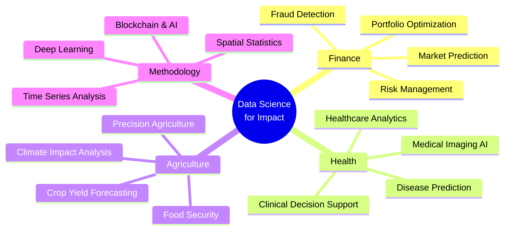

<h1 align="center">
  
</h1>

<h3 align="center">🎓 Senior Data Scientist & Engineer in Statistical Work | Specializing in Finance, Health & Agriculture</h3>

<p align="center">
  
  
  
</p>

<p align="center">
  
  
  
</p>

---

## 🌐 Connect with Me
<p align="center">
  <a href="https://www.linkedin.com/in/pinel-baudelaire-dahoui" target="_blank">
    
  </a>
  <a href="mailto:tpineldahoui@gmail.com" target="_blank">
    
  </a>
  <a href="https://github.com/Baudelaire12" target="_blank">
    
  </a>
  <a href="https://sites.google.com/view/pineldahoui" target="_blank">
    
  </a>
</p>

---

## 👨‍💻 About Me  

I am a **Senior Data Scientist and Engineer in Statistical Work** passionate about developing **data-driven solutions** to address complex challenges in **finance, healthcare, and agriculture**. With expertise in **machine learning, statistical modeling, and programming**, I create innovative projects that generate tangible impacts on decision-making processes.

🎓 **Currently pursuing:** Master's in Mathematical Statistics Applied to the Life Domain at CIPMA-CHAIRE UNESCO

💡 **Core Expertise:**
- 📊 **Statistical Modeling & Econometrics**: Time series analysis, spatial regression, ARIMA modeling, panel data analysis
- 🤖 **Machine Learning & AI**: Supervised/unsupervised learning, deep learning, computer vision, NLP
- 💰 **Quantitative Finance**: Portfolio optimization (Markowitz, Sharpe), risk modeling, financial forecasting
- 🏥 **AI for Health**: Medical imaging analysis, predictive health analytics, disease detection
- 🌾 **Agricultural Analytics**: Crop yield prediction, climate impact analysis, geospatial modeling
- ☁️ **Big Data & HPC**: Parallel computing, distributed systems, cloud deployment (AWS, GCP, Azure)

---

## 📈 Key Impact Metrics  
<p align="center">
  
  
  
  
</p>

---

## 🚀 What I'm Currently Working On  
- 🔬 **AI-Powered Sickle Cell Detection**: Automatic detection of vaso-occlusive crises using medical imaging & deep learning
- 🔐 **Blockchain for AI Auditability**: Research on blockchain architecture for AI decision certification in pneumonia diagnosis from chest X-rays
- 📈 **Portfolio Optimization Platform**: Democratizing professional investment techniques for African markets (BRVM integration)
- 🌍 **Air Quality Prediction**: ML models for PM2.5 pollution forecasting across African cities using satellite data
- 👨‍🏫 **Teaching & Mentoring**: Python programming, LaTeX, algorithms & data science at African School of Economics and Quinty Mind
- 📚 **Academic Research**: Master's thesis on mathematical statistics applications in life sciences

---

## 🎯 Research Interests  


---

## 🏆 Featured Projects  

### 💼 [Portfolio Optimizer Pro](https://optimization-portefeuille-1.onrender.com) | [Repository](https://github.com/Baudelaire12/portfolio-optimization) 🚀  
**AI-driven investment optimization platform democratizing professional portfolio techniques**
- Implemented Markowitz mean-variance optimization for efficient frontier calculation
- Integrated Yahoo Finance API for real-time market data retrieval
- Created interactive risk-return visualizations and dashboards
- Adapted architecture for African financial markets (BRVM) integration
- **Tech Stack:** Python, Streamlit, Pandas, NumPy, Plotly, Yahoo Finance API

### 🏥 WIRU – AI-Powered Health & Security Application 🔍  
**Computer vision solution for critical individual identification**
- Facial similarity comparison for unconscious patient identification and missing persons
- Photo-based identification with multi-database synchronization (medical, administrative)
- Quick and secure access to essential data in emergency situations
- **Tech Stack:** Python, OpenCV, Deep Learning, Face Recognition APIs

### 🌍 [AirQo African Air Quality Prediction](https://github.com/Baudelaire12/air-quality-prediction) 🥈  
**Silver Medal winner in international competition**
- Predicted PM2.5 pollution levels using satellite-based AOD data across 8 African cities
- Built ML models validated against ground-based monitoring data
- Addressed climate data gaps to support public health and urban resilience planning
- **Tech Stack:** Python, LightGBM, Random Forest, Google Earth Engine, Scikit-Learn

### 📊 Scientific Research: Cocoa Production & Conflicts in Côte d'Ivoire 📄  
**Spatio-temporal analysis of cocoa production and conflict dynamics (1997-2022)**
- Applied Moran's I statistics, spatial regression models, and time series analysis
- Key finding: No spatial or temporal evidence of direct link between cocoa production and conflict
- **Tech Stack:** R, Python, Spatial Statistics, GeoPandas, Time Series Analysis

### 📈 [Benin Population Growth Forecasting to 2050](https://github.com/Baudelaire12/population-forecasting) 📊  
**ARIMA-based demographic projection study**
- Provided accurate population projections for strategic planning in infrastructure and healthcare
- Generated insights for sustainable development and resource allocation policies
- **Tech Stack:** Python, R, ARIMA, Time Series Analysis, Statsmodels

### 🏦 [Fraud Detection System](https://github.com/Baudelaire12/fraud-detection) 🔐  
**ML-based fraudulent transaction detection**
- Implemented advanced ML models with oversampling techniques for imbalanced data
- Enhanced financial transaction security with high precision-recall performance
- **Tech Stack:** Python, XGBoost, SMOTE, Scikit-Learn, Feature Engineering

---

## 🎯 Skills Matrix  

<table align="center">
<tr>
<td align="center" width="50%">

### 💼 Domain Expertise
```python
skills = {
    "Finance": ["Portfolio Optimization", "Risk Modeling", 
                "Time Series Forecasting", "Fraud Detection"],
    "Healthcare": ["Medical Imaging", "Disease Prediction",
                   "Clinical Analytics", "AI Diagnostics"],
    "Agriculture": ["Crop Yield", "Climate Analysis",
                    "Geospatial Modeling", "Food Security"],
    "Research": ["Statistical Modeling", "Spatial Analysis",
                 "Econometrics", "Academic Writing"]
}
```

</td>
<td align="center" width="50%">

### 🛠️ Technical Proficiency
```python
tech_stack = {
    "Languages": ["Python ⭐⭐⭐⭐⭐", "R ⭐⭐⭐⭐⭐",
                  "SQL ⭐⭐⭐⭐", "LaTeX ⭐⭐⭐⭐"],
    "ML/DL": ["Scikit-Learn", "TensorFlow", "PyTorch",
              "XGBoost", "LightGBM", "Keras"],
    "Tools": ["Git", "Docker", "Jupyter", "Streamlit"],
    "Cloud": ["AWS", "GCP", "Azure", "HPC Clusters"]
}
```

</td>
</tr>
</table>

---

## 🎓 Certifications & Achievements  
- 🏅 **Silver Medal** – AirQo African Air Quality Prediction Challenge
- ✅ **Data Science with Python** – Simplilearn & Brown University (2023)
- ✅ **Data Science & AI** – Africa TechUP Tour (2024)
- ✅ **High-Performance Computing** – Institute of Mathematics and Physical Sciences, Benin (2023)
- ✅ **Monitoring, Evaluation & Development Project Management** – Campus AFD, France (2023)
- 🎓 **Bachelor's in Econometrics & Applied Statistics** – FASEG UAC, Benin (2018-2021)

---

## 🛠️ Tech Stack  

### 💻 Programming Languages  
<p align="left">
    
    
    
    
</p>

### 📊 Data Science & Machine Learning  
<p align="left">
    
    
    
    
    
    
    
    
</p>

### 📈 Visualization & BI  
<p align="left">
    
    
    
    
</p>

### ☁️ Cloud & Big Data  
<p align="left">
    
    
    
    
</p>

### 🔧 Development Tools  
<p align="left">
    
    
    
    
</p>

---

## 📊 GitHub Statistics  

<p align="center">
  
</p>

<p align="center">
    
    
</p>

<p align="center">
    
    
</p>

<details>
<summary>📊 <b>More Statistics</b></summary>
<br>
<p align="center">
  
</p>
<p align="center">
  
  
</p>
</details>

---

## 💬 Open to Opportunities  
I'm actively seeking opportunities in:
- 📊 **Data Science & AI Engineering** roles in finance, health, and agriculture
- 🔬 **Research positions** in machine learning, statistical modeling, and AI applications
- 🤝 **Collaborative projects** addressing real-world challenges with data-driven solutions
- 🎓 **Teaching & mentoring** in data science, Python programming, and statistical analysis

**💼 Ideal Collaborations:**
- 🌍 International organizations working on sustainable development in Africa
- 🏦 Fintech companies focusing on African markets
- 🏥 Healthcare institutions implementing AI-driven diagnostics
- 🎓 Academic institutions for research partnerships

---

## 📝 Latest Blog Posts & Publications  
<!-- BLOG-POST-LIST:START -->
- 🔬 **Cocoa Production and Conflicts in Côte d'Ivoire** - Spatio-temporal dynamics analysis (1997-2022)
- 📊 **Predictive Analysis of Benin's Population Growth by 2050** - ARIMA modeling for demographic forecasting
- 🌍 **Air Quality Monitoring in African Cities** - ML approaches for environmental health
<!-- BLOG-POST-LIST:END -->

➡️ [Read more on my portfolio](https://sites.google.com/view/pineldahoui)

---

## 🤝 Let's Collaborate!  

<p align="center">
I'm always excited to work on innovative projects that combine <b>data science, AI, and social impact</b>. Whether you're looking for:
</p>

<p align="center">
  
  
  
  
</p>

<p align="center">
  <b>📧 Feel free to reach out: <a href="mailto:tpineldahoui@gmail.com">tpineldahoui@gmail.com</a></b>
</p>

---

## 📚 Recent Activity  
<!--START_SECTION:activity-->
<!--END_SECTION:activity-->

---

## ⚡ Fun Fact  
I see data as a puzzle where every piece tells a story. My passion lies in assembling these pieces to uncover powerful insights that drive meaningful change! 🧩📈✨

---

<p align="center">
  
</p>
